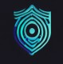
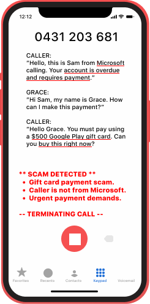
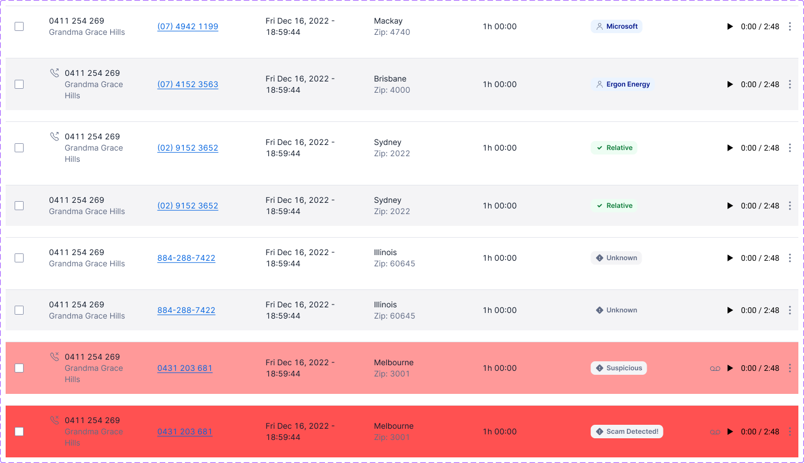
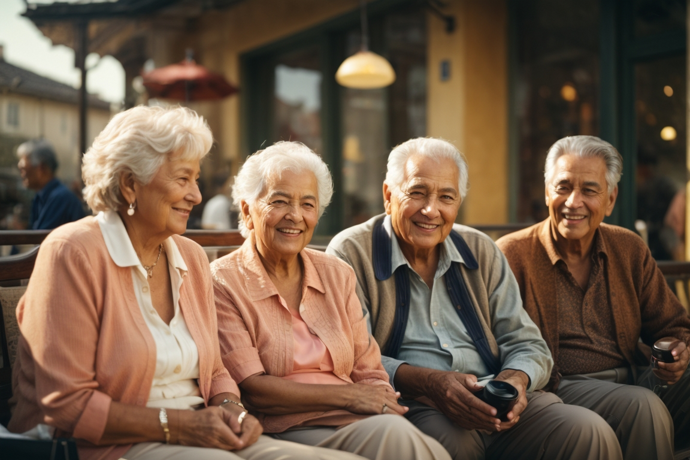

# Team Chronos2 - CyberGuardian.io - GovHack2023

| Project  | Details  |
| ------------ | ------------ |
|  Team | Team Chronos2 |
|  Project |  CyberGuardian.io |
|  Hackerspace |  https://hackerspace.govhack.org/projects/cyberguardian_io |
|  Website |  https://cyberguardian.pages.dev |
|  Video |  https://9xsy.short.gy/CyberGuardian |
|  Work Evidence | https://github.com/ChrisPVella/GovHack2023-CyberGuardian.io  |
|  Members | Chris Vella |
|  Tags | #ai #cybersecurity #phishing #seniors #elders #spoofing #protection #education |

## Project Description

# CyberGuardian.io - AI Defence Against Scams Targeting Aussie Seniors

## Executive Summary
CyberGuardian.io is a pioneering solution to protect Australian seniors from scams and fraud using advanced AI technology. This project is designed to shield seniors from financial, emotional, and mental harm by providing comprehensive protection against scams through real-time detection, blocking, and education. 

## Introduction
### Background
Scams targeting seniors are an alarming and growing problem in Australia. These attacks aren't just financially devastating, they also cause declines in mental and physical health, with many seniors left socially isolated and afraid to use technology again. CyberGuardian.io was conceived to provide a targeted and intelligent solution for seniors who are often left without sufficient protection.

### Objective
To empower seniors with robust protection against scams by employing cutting-edge technology that includes phone call defence, phishing blocking, dashboard alerts, and ongoing education.

## System Overview
### How It Works
CyberGuardian.io operates as an iOS and Android application, replacing native calling and messaging apps and employing natural language processing for:

* Phone Call Defence: Transcription and analysis of conversations to detect number and voice spoofing, dubious claims, and typical scam terminology. It offers the ability to interrupt scam calls in progress.
* Phishing Blocking: Identification and obstruction of deceptive links, false login prompts, fake bank warnings, and other common phishing tactics.
* Dashboard Alerts: Instant alerts to users and trusted contacts like family or carers, enabling quick intervention if scams are detected.
* Ongoing Education: Contextual education at the point of a scam, providing education that is more likely to stick.
* Privacy Protection: On-device Large Language Model ensures data privacy.
* Family Collaboration: Allows family members to co-manage settings for added protection.
* User-friendly Interface: Designed with seniors in mind, providing an easy-to-use experience.

## Benefits
### New Technology
CyberGuardian.io has only become viable due to recent advancements in generative AI and LLMs. This has opened an entirely new range of possibilities, including the sophisticated natural language processing and instant analysis of the app.

### Comprehensive Security
Offers an all-encompassing shield against various scams including phishing, vishing, smishing, investment fraud, and identity theft.

### Mental and Physical Well-being
Ensures peace of mind, reducing stress and anxiety caused by scams. Reduceds the likelihood of financial losses and falling victim to a scam.

### Education and Awareness
Keeps users informed and educated about evolving scam methods, enhancing their ability to recognise and avoid potential threats.

### Community Engagement
Encourages collaboration and support between seniors and their trusted contacts, fostering a community of care and vigilance.

## Demo - Phone Call with Transcription
 

## Demo - Family Co-Management Dashboard

## Conclusion
CyberGuardian.io stands as a beacon of hope against scams targeting Australian seniors. Its advanced features and user-centric approach not only prevent financial loss but also promote a safer and more informed digital environment. It symbolises a community-driven approach to care, protection, and empowerment of seniors in the digital age.

### About Team Chronos2
Team Chronos2 include Chris Vella from Mackay, QLD. CyberGuardian.io was a second GovHack project that I was passionate about and wanted to tackle on top of the main project.

